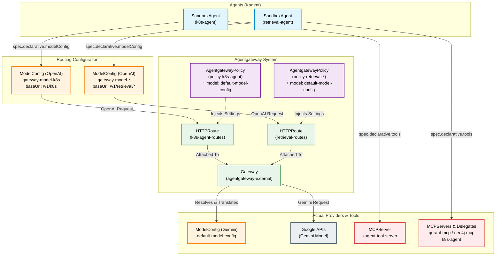

# Agentgateway Decoupled Architecture

This diagram illustrates how the `k8s-agent` and retrieval agents are decoupled from their underlying models and tools using the Agentgateway architecture.

## How It Works

1. **The Dummy Provider**: The `SandboxAgent` is configured to use a `ModelConfig` that acts like an OpenAI provider (e.g., `gateway-model-k8s`). 
2. **The Route**: Instead of going to OpenAI, this config's `baseUrl` forces the traffic to hit a specific path on your cluster's `Agentgateway` (e.g., `/v1/k8s`).
3. **The Policy Injection**: Once the request hits the matching `HTTPRoute`, the attached `AgentgatewayPolicy` intercepts the traffic. It dynamically injects the *real* model configuration (`default-model-config`).
4. **The Translation**: The Gateway processes the OpenAI-formatted request, identifies that `default-model-config` uses Gemini, translates the payload into Google's format, and sends it out to the external Gemini API.
5. **Tool Execution**: Tool execution remains natively bound to the `SandboxAgent` through its `spec.declarative.tools` array, allowing the Agent runtime to securely execute LLM tool calls against internal MCP servers.
